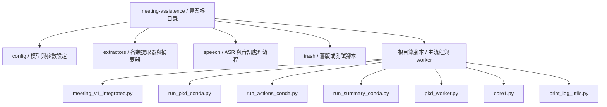
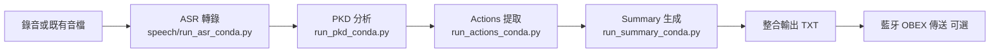

# meeting-assistence

## 快速跳轉

- [專案流程](#專案流程)
- [專案目錄導覽](#專案目錄導覽)
- [主要檔案](#主要檔案)
- [執行環境](#執行環境)
- [樹莓派測試環境](#樹莓派測試環境)
- [環境配置](#環境配置)
- [模型與路徑設定](#模型與路徑設定)
- [快速開始](#快速開始)
- [輸出檔案說明](#輸出檔案說明)
- [藍牙傳送](#藍牙傳送)
- [除錯與記錄](#除錯與記錄)
- [授權](#授權)

會議語音到摘要的離線處理專案，包含：

- 音訊錄製（mkv）
- ASR 轉錄（切分多個 SRT）
- People / Keypoints / Decisions 三類報告（PKD）
- 行動項目提取（Actions）
- 會議摘要生成（Summary）
- 匯出整合 TXT
- 藍牙 OBEX 自動傳送結果檔（可關閉）

目前主要入口是 `meeting_v1_integrated.py`，其參數在程式內 `main()` 先行固定。

## 專案目錄導覽

### 目錄圖

### 目錄索引

- [根目錄腳本](#根目錄腳本)
- [config](#config)
- [extractors](#extractors)
- [speech](#speech)
- [trash](#trash)

### 根目錄腳本

這一層放的是主要執行入口與共用核心模組，負責把錄音、轉錄、提取、摘要和輸出串起來。

- `meeting_v1_integrated.py`: 整合主流程控制器，依序執行錄音、ASR、PKD、Actions、Summary、TXT 輸出與藍牙傳送
- `pkd_worker.py`: 負責把 SRT 轉成 People、Keypoints、Decisions 的核心工作
- `run_pkd_conda.py`: PKD worker 啟動腳本，輸出 `*_pkd_cache.json`
- `run_actions_conda.py`: 行動項目提取腳本，輸出 `*_actions_cache.json`
- `run_summary_conda.py`: 摘要生成腳本，輸出 `*_summary_cache.json`
- `core1.py`: SRT 解析、字幕分段與 llama.cpp 推論核心
- `print_log_utils.py`: 將 `print` 同步寫入 log 檔

### config

- [回到目錄索引](#目錄索引)

此資料夾集中管理模型與推論設定，避免各腳本分散寫死參數。

- `model_config.py`: 定義 People、Keypoints、Decisions、Actions、Summary 的模型路徑與推論參數
- `__init__.py`: Python 套件初始化檔

### extractors

- [回到目錄索引](#目錄索引)

這一層是各類語意提取器的實作區，負責把字幕內容轉成結構化文字。

- `base_extractor.py`: 共用提取器基底類別，封裝 llama.cpp 載入與記憶體管理
- `people_extractor.py`: 人物辨識與人物摘要
- `keypoints_extractor.py`: 會議重點提取與整理
- `decisions_extractor.py`: 決策、承諾、共識提取
- `actions_extractor.py`: 行動項目提取
- `summary_generator.py`: 根據 PKD 與行動項目生成最終摘要
- `__init__.py`: 匯出提取器模組

### speech

- [回到目錄索引](#目錄索引)

這一層處理音訊、ASR、字幕切分與轉錄流程，是從影音檔進入文字分析的入口。

- `pipeline_mkv_read.py`: 即時 ASR 與說話者識別核心，負責讀取音訊、切片與產出 SRT
- `pipeline_mkv_write.py`: 音訊寫入/錄音相關流程
- `run_asr_conda.py`: ASR worker 啟動腳本，從音訊檔產出字幕檔

### trash

- [回到目錄索引](#目錄索引)

這裡放的是舊版、測試版或暫時保留的腳本，不建議作為正式入口。

- `app.py`: 舊版應用程式入口
- `run_pipeline.py`: 舊版整合流程測試腳本
- `test_summary_prompt.py`: 摘要提示詞測試
- `cleanup_20260404_084031/`: 清理或暫存資料夾

### 根目錄其他輸出與資料夾

- `output_*.json`、`output_*.txt`、`output_*.srt`: 範例輸出與 cache
- `tmp_seg_*.wav`、`tmp_spk_*.wav`: ASR 過程中建立的暫存音訊
- 各個會議名稱資料夾: 每次執行後的案例輸出目錄，裡面通常包含 SRT、Markdown、TXT 與摘要結果

## 專案流程

### 視覺化流程圖

### 文字流程

整體流程由 `MeetingWorkflow.run()` 依序執行：

1. step1 錄音（可停用，改用既有音檔）
2. step2 ASR（`speech/run_asr_conda.py`）
3. step3 PKD（`run_pkd_conda.py`）
4. step4 Actions（`run_actions_conda.py`）
5. step5 Summary（`run_summary_conda.py`）
6. step6 匯出 TXT + 藍牙傳送

另外也可分步執行各 worker 腳本。

## 主要檔案

- `meeting_v1_integrated.py`: 主流程控制器，含藍牙傳送整合
- `speech/pipeline_mkv_read.py`: ASR 與說話者分段核心
- `speech/run_asr_conda.py`: ASR worker 入口
- `pkd_worker.py`: PKD 核心（People / Keypoints / Decisions）
- `run_pkd_conda.py`: PKD worker 入口
- `run_actions_conda.py`: Actions worker 入口
- `run_summary_conda.py`: Summary worker 入口
- `core1.py`: SRT 解析、分段與 llama.cpp 推論核心
- `extractors/`: 各類提取器與摘要器
- `config/model_config.py`: 提取器模型參數設定
- `print_log_utils.py`: 將 print 同步寫入 log

### 常用腳本快速連結

- [主流程控制器](meeting_v1_integrated.py)
- [ASR worker](speech/run_asr_conda.py)
- [PKD worker](run_pkd_conda.py)
- [Actions worker](run_actions_conda.py)
- [Summary worker](run_summary_conda.py)
- [PKD 核心](pkd_worker.py)
- [ASR 核心](speech/pipeline_mkv_read.py)
- [模型設定](config/model_config.py)

## 執行環境

建議環境：Linux（目前程式寫法依賴 Linux 工具與藍牙堆疊）。

必要系統工具：

- ffmpeg
- arecord（ALSA）
- 藍牙工具（bluez / obex；若有啟用藍牙傳送）

Python 套件（依現有程式）：

- llama-cpp-python
- psutil
- numpy
- soundfile
- funasr
- opencc（或對應 Python 套件）
- dbus-python
- PyGObject

## 樹莓派測試環境

目前專案的程式註解與參數設定，是以 Raspberry Pi 5 16GB 為主要測試基準，並以 CPU 推論為主，不依賴 GPU。

### 硬體基準

- Raspberry Pi 5
- 記憶體：16GB
- 架構：ARM64 / aarch64
- CPU：4 核心
- 儲存：建議使用 SSD 或高品質 microSD，避免長時間 ASR 與模型載入時 I/O 過慢
- 音訊：USB 麥克風或 ALSA 可見的錄音裝置
- 藍牙：若要啟用結果傳送，需有可用的藍牙堆疊與 OBEX 服務

### 系統版本基準

- Linux 64-bit
- 建議使用 Raspberry Pi OS 64-bit 或相容的 Debian 系統
- 專案目前程式碼是以 user-space conda 路徑與 systemd user service 的操作方式撰寫
- 若是 Raspberry Pi OS，建議使用較新的 Bookworm 系列環境

### Conda 基準

- Conda Python：`/home/cgu-csie/miniconda3/bin/python3`
- Python 版本：3.10
- 啟動方式：`conda activate meeting-assistence`
- 若你要重現目前專案的測試方式，請保持 `llama-cpp-python`、`funasr`、`opencc-python-reimplemented`、`dbus-python`、`PyGObject` 可用
- conda環境的重現可以參考`environment.yml`

### 專案中的 Raspberry Pi 參數

- `core1.py` 會依記憶體自動調整 `n_ctx`
- 16GB 機器會使用 `n_ctx=8192`
- 8GB 機器會使用 `n_ctx=4096`
- 低於 8GB 時會降到 `n_ctx=2048`
- `llama.cpp` 推論執行緒數目前固定為 4

### 測試時的實際建議

- 先確認 `ffmpeg`、`arecord`、`obex`、`dbus` 都可用
- 先用既有音檔跑 ASR，不要先開錄音流程
- 先關閉藍牙傳送，確認 `run_asr_conda.py`、`run_pkd_conda.py`、`run_actions_conda.py`、`run_summary_conda.py` 可正常產生檔案，再打開整合流程
- 若模型載入太慢，優先檢查模型是否在 SSD 或高速度儲存裝置上

## 環境配置

本專案建議優先使用 Conda。若你使用 pip 也可執行，但 dbus 與 GI 相關套件建議由系統套件管理器安裝。

### 1) 安裝系統套件（Ubuntu / Debian）

先安裝音訊、藍牙、GLib 與基本編譯依賴：

sudo apt update
sudo apt install -y ffmpeg alsa-utils bluez bluez-obexd libsndfile1 libdbus-1-dev libglib2.0-dev libgirepository1.0-dev python3-gi python3-dev build-essential

若要使用藍牙 OBEX 傳檔，確認服務可用：

systemctl --user enable obex
systemctl --user start obex
systemctl --user status obex

### 2) 使用 Conda 建環境（推薦）

專案已提供 [environment.yml](environment.yml)：

conda env create -f environment.yml
conda activate meeting-assistence

### 3) 使用 Pip 建環境（替代）

專案已提供 [requirements.txt](requirements.txt)：

python3 -m venv .venv
source .venv/bin/activate
python -m pip install --upgrade pip
pip install -r requirements.txt

### 4) 驗證環境

python -c "import numpy, soundfile, psutil; print('core ok')"
python -c "import llama_cpp; print('llama ok')"
python -c "import opencc; print('opencc ok')"
python -c "import dbus; import gi; print('dbus gi ok')"

### 5) 離線模型路徑

ASR 預設模型快取目錄為：

- /home/cgu-csie/.cache/modelscope

若你放在其他位置，可在執行前先設定：

export MODELSCOPE_CACHE=/your/modelscope/cache

LLM GGUF 預設路徑為：

- /home/cgu-csie/qwen3-4b-instruct-2507-q8_0.gguf

若路徑不同，請同步調整：

- meeting_v1_integrated.py 中 MeetingWorkflow 的 model_path
- 或使用 run_pkd_conda.py 的 --model-path 參數

## 模型與路徑設定

### 1) PKD / Actions / Summary 使用的 LLM

預設模型路徑在多處使用：

- `/home/cgu-csie/qwen3-4b-instruct-2507-q8_0.gguf`

可調整位置：

- `meeting_v1_integrated.py` 的 `MeetingWorkflow(... model_path=...)`
- `run_pkd_conda.py` 以 `--model-path` 指定
- `config/model_config.py` 中各 extractor 設定

### 2) ASR 模型快取

`speech/pipeline_mkv_read.py` 預設使用：

- `/home/cgu-csie/.cache/modelscope`

程式已設為離線模式環境變數（HF / datasets / modelscope）。

## 快速開始

以下命令假設你在專案根目錄執行。

### A. 一次跑完整流程

直接執行：

`python3 meeting_v1_integrated.py`

注意：

- 目前 `main()` 內部是固定參數，不是 CLI 參數模式。
- 預設 `enable_recording=False`，會直接使用既有音檔：`output_audio.mkv`。
- 若要開啟錄音或調整輸出、藍牙等行為，請修改 `meeting_v1_integrated.py` 內 `MeetingWorkflow(...)` 的初始化參數。

### B. 分步執行（建議除錯時使用）

1) ASR

`python3 speech/run_asr_conda.py --audio ./output_audio.mkv --outdir . --prefix output --alpha 0.0 --overlap 5.0 --verbose`

2) PKD

`python3 run_pkd_conda.py --output-dir . --output-prefix output --model-path /home/cgu-csie/qwen3-4b-instruct-2507-q8_0.gguf --interval-minutes 5 --overlap-seconds 60`

3) Actions

`python3 run_actions_conda.py --output-dir . --output-prefix output`

4) Summary

`python3 run_summary_conda.py --output-dir . --output-prefix output`

## 輸出檔案說明

以 `output_prefix=output` 為例：

- `output_audio.mkv`: 錄音檔
- `output_1.srt`, `output_2.srt`, ...: ASR 字幕分段輸出
- `finalp_output_1.md`, ...: People 報告
- `finalk_output_1.md`, ...: Keypoints 報告
- `finald_output_1.md`, ...: Decisions 報告
- `output_pkd_cache.json`: PKD 聚合結果
- `output_actions_cache.json`: Actions 結果
- `output_summary_cache.json`: Summary 結果
- `output_cache.json`: step3 + step4 共享 cache
- `output_actions.txt`: 行動項目文字檔
- `output_summary.txt`: 摘要文字檔
- `output_meeting_summary.txt`: 最終整合輸出（step6）
- `output_run.log` 或 `output_run_YYYYmmdd_HHMMSS.log`: 執行 log

## 藍牙傳送

`meeting_v1_integrated.py` 內建 OBEX 傳送，會優先送到已配對且已連線裝置，否則選第一個配對裝置。

常見檢查：

- `systemctl --user status obex`
- `systemctl --user restart obex`

可用 `enable_bluetooth=False` 關閉。

## 除錯與記錄

專案多數流程以 print 為主，並透過 `print_log_utils.setup_print_logging()` 同步寫 log。若要追流程，優先看：

- 終端 print 訊息
- `*_run.log` 檔案

## 授權

請參考 `LICENSE.txt`。
